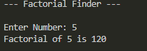

# AIM: Design a Python program to compute the factorial of a given integer N.

Example 1
## Input
```
Enter Number: 5
```

## Output
```
Factorial of 5 is 120
```


Example 2
## Input
```
Enter Number: -5
```

## Output
```
Factorial of 5 is Not Defined
```

## Sample Output
